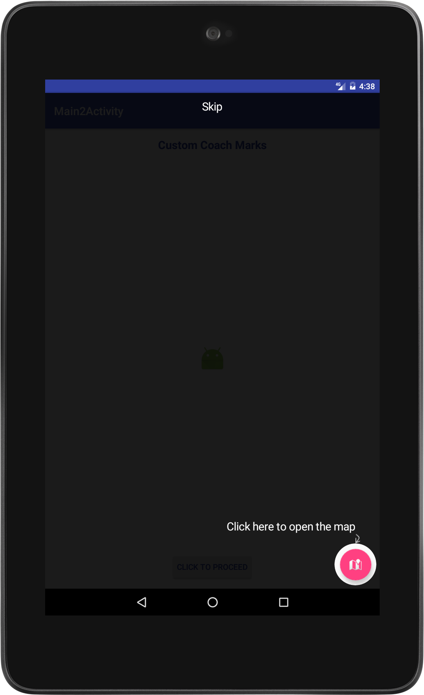
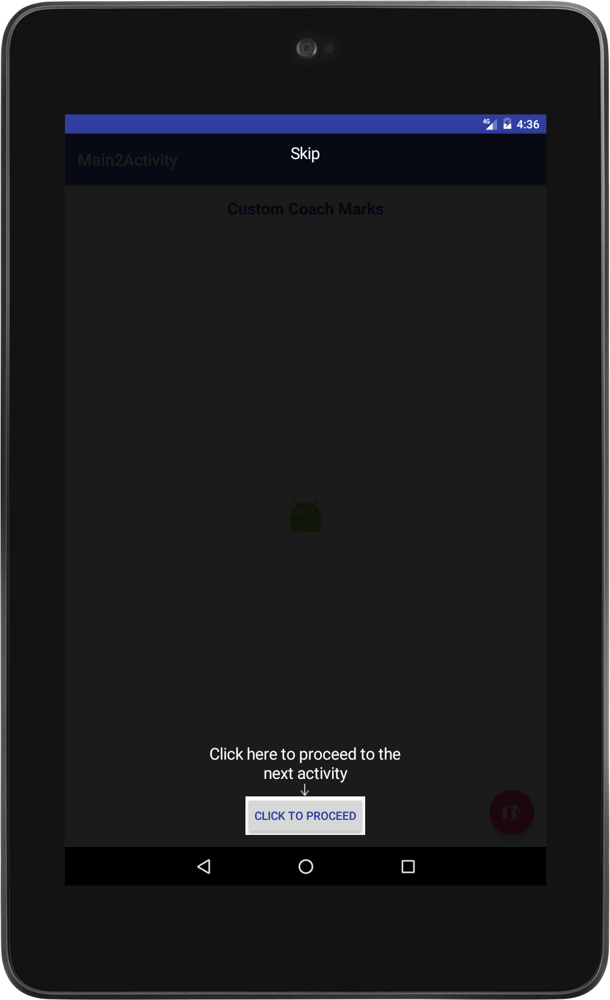
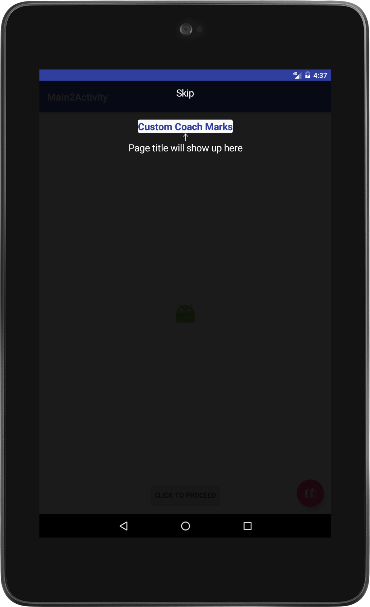
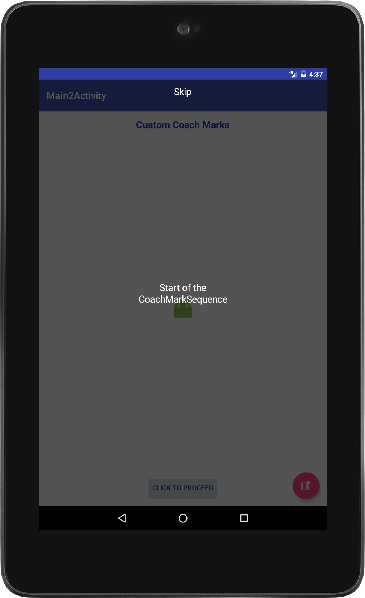
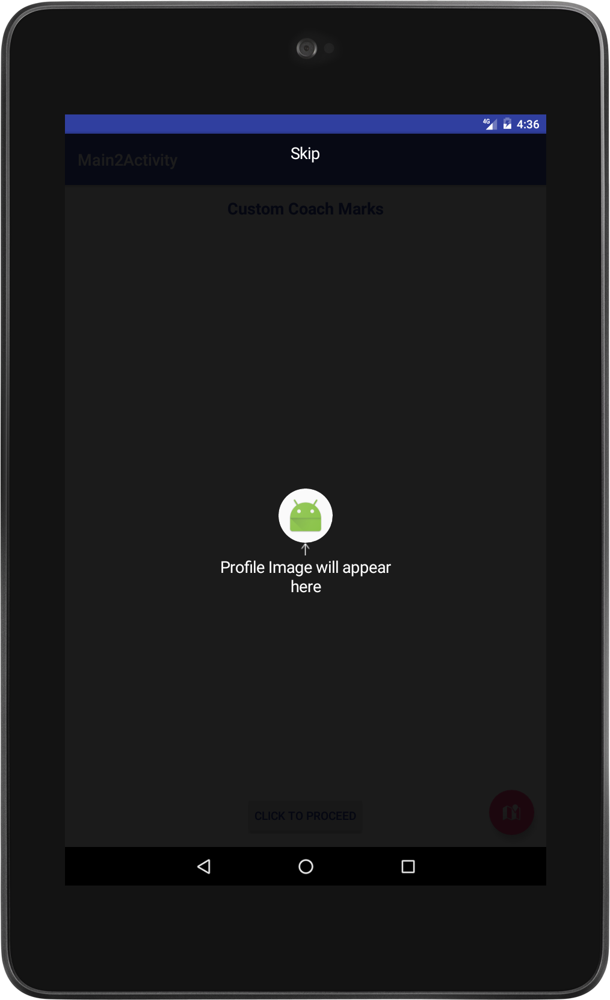

# CustomCoachMarksLibrary
Displays popup instructionals(coachmarks) either standalone or sequence for android applications

The CustomCoachMarks library is a simple coachmarks library using popups to display the instructions. They can be customized to fit the required custom look.

The view in focus can be displayed or made to stand out by displaying it in three cutout shapes:
(**Circle, Rectangle, Rounded Rectangle**)

| Circle | Rectangle | Rounded Rectangle |
| --- | --- | --- |
|  |  |  |

Adding the library to your project
===
To use the library download the aar file and add it to your projects libs folder (~/app/libs).

Add the following to the projects build.gradle file:
~~~
allprojects {
    repositories {
        jcenter()
        flatDir {
            dirs 'libs'
        }
    }
}
~~~

Now add the library as a dependency in the modules build.gradle file:
~~~
compile(name:'customcoachmarks',ext:'aar')
~~~

Usage
===
The coachmark added can target a view or just display a message.

| Plain Message | Display View |
| --- | --- |
|  |  |

-
To display a single coachmark, instantiate a CoachMark object and configure it as required.

An Example:
~~~
CoachMark coachMark = new CoachMark(MainActivity.this,MainActivity.this.getWindow())
                .configureContentTextAttr("Click this button",Color.parseColor("#35ce8d"),24,null,250)
                .setAllowViewTouch(false)
                .setAllowSkipCoachMark(false)
                .setContentLabelDirection(CoachMark.Direction.BOTTOM_RIGHT);
        coachMark.showCoachMark(lblServerName, CoachBackgroundView.CutoutShape.RECTANGLE);
~~~

-
To display a sequence of coachmarks use the CoachMarksSequence and CoachMark objects to the sequence instance.

~~~
CoachMarksSequence sequence = new CoachMarksSequence(SampleActivity.this)
                .addToSequence(new CoachMark(SampleActivity.this,this.getWindow())
                        .configureContentTextAttr("Start of the CoachMarkSequence", Color.WHITE,20,null,0)
                        .configureMaskAttr(0,170)
                        .setAllowSkipCoachMark(true)
                        .setAllowChangeOnBackgroundTouch(true),null,null)
                .addToSequence(new CoachMark(SampleActivity.this,this.getWindow())
                        .configureContentTextAttr("Click here to open the map",Color.WHITE,20,null,0)
                        .configureMaskAttr(0,170)
                        .setAllowSkipCoachMark(true)
                        .addCutoutSpacing(10)
                        .setAllowChangeOnBackgroundTouch(true),btnMap, CoachBackgroundView.CutoutShape.CIRCLE);
                        
sequence.start();
~~~

-
The CoachMark will notify the delegate on three occassions. To perform any actions during these intervals implement the CoachMarkPopupDelegate interface and set the delegate for the CoachMark, on which the following methods will have to be overridden.

~~~
@Override
    public void onCoachMarkWillDisplay(CoachMark coachMark) {

    }

    @Override
    public void onCoachMarkWasDismissed() {

    }

    @Override
    public void onCoachMarkSkipped() {

    }
~~~

-
Similarly the CoachMarkSequence will also notify its delegate on three occassions. To perform any actions implement the CoachMarkSequenceResponder interface and set the delegate for the CoachMarkSequence on which the following methods will have to be overridden.

~~~
    @Override
    public void onCoachMarksWillDisplay(int position, CoachMark coachMark) {

    }

    @Override
    public void onCoachMarksWillDissappear(int position, CoachMark coachMark) {

    }

    @Override
    public void onCoachMarkSequenceDidComplete(boolean wasskipped) {

    }
~~~

License
===
CustomCoachMarksLibrary is distributed under an Apache 2.0 License. See LICENSE for details.
